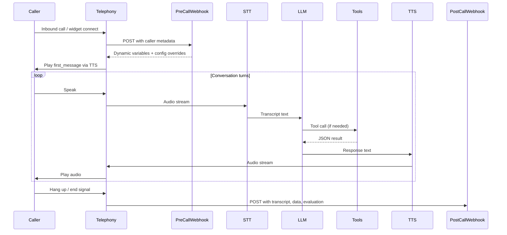

# ElevenLabs Agent Architecture

This document explains how ElevenLabs conversational agents work under the hood — the components involved, how they connect, and where time is spent.

## Call Lifecycle

Every agent conversation follows the same lifecycle, whether triggered by an inbound phone call, an outbound dial, or a web widget.



### Phase-by-phase breakdown

1. **Connection** — The caller connects via phone (Twilio, Telnyx, SIP) or web widget. ElevenLabs assigns a `conversation_id`.

2. **Pre-call webhook** (optional) — Before the agent speaks, ElevenLabs POSTs caller metadata (phone number, agent ID, any custom headers) to your webhook. You return dynamic variables and config overrides. Hard timeout: **5 seconds**.

3. **First message** — The agent's `first_message` is synthesized via TTS and played to the caller. If the pre-call webhook overrode `first_message`, the override is used.

4. **Conversation loop** — Each turn follows: caller speaks → STT transcribes → LLM generates a response (possibly calling tools mid-turn) → TTS synthesizes → audio plays back.

5. **Hang-up** — When the call ends, ElevenLabs fires the post-call webhook with the full transcript, collected data, and evaluation results.

## Component Breakdown

### STT (Speech-to-Text)

ElevenLabs handles ASR (automatic speech recognition) internally. You configure it through:

- **Language**: Set to `en` for English, or the appropriate language code.
- **ASR keywords**: Boost recognition accuracy for domain-specific terms (brand names, product codes, medical terms). Format: `word:weight` where weight is typically 1-5.

STT runs continuously while the caller speaks, streaming partial transcripts to the LLM for faster turn detection.

### LLM (Language Model)

The LLM is the brain of the agent. It receives:
- The system prompt you wrote
- Dynamic variables injected at conversation start
- The running conversation transcript
- Tool results from any mid-conversation tool calls

Supported models include Gemini, GPT-4o, Claude, and custom models via OpenRouter. Model choice directly impacts latency and response quality.

### TTS (Text-to-Speech)

TTS converts the LLM's text response into audio. Key settings:
- **Model**: `eleven_flash_v2` (~75ms), `eleven_turbo_v2` (~100ms), `eleven_flash_v2_5` (~90ms), `eleven_multilingual_v2` (~150ms)
- **Voice**: A cloned or library voice
- **Stability, similarity_boost, speed**: Fine-tune how the voice sounds

TTS streams audio back as it generates, so the caller hears the beginning of the response before the full response is synthesized.

## Webhooks

### Pre-call Webhook

Fires when a conversation starts, before the agent speaks. Use it to:
- Look up the caller in your CRM by phone number
- Inject context (name, account status, open tickets) as dynamic variables
- Override `first_message` for personalized greetings
- Override `system_prompt` based on caller segment
- Route to a different agent configuration

**Request**: POST with `{ agent_id, conversation_id, caller_id (phone number) }`

**Response**: Must return within 5 seconds. Return dynamic variables and optional config overrides.

### Post-call Webhook

Fires after the conversation ends. Receives:
- Full transcript (every utterance, timestamped)
- `conversation_id` and `agent_id`
- Collected data fields (structured extraction results)
- Evaluation criteria results (quality scores)
- Call duration, status, and metadata

Use it to update your CRM, log call outcomes, trigger follow-up workflows, or flag calls that need human review.

## Tools (Server-Side)

Tools let your agent call external systems mid-conversation. When the LLM decides it needs information or needs to take an action, it issues a tool call.

### How it works

1. You define a tool in the agent config with a name, description, parameters (JSON Schema), and a webhook URL.
2. During conversation, the LLM decides to call the tool based on the conversation context and the tool's description.
3. ElevenLabs POSTs the tool call to your webhook with the extracted parameters.
4. Your webhook processes the request and returns a JSON response.
5. The LLM incorporates the tool result into its next response.

### Tool design principles

- **Description matters**: The LLM uses the description to decide *when* to call the tool. Be specific.
- **Return useful error messages**: If a lookup fails, return `{"error": "No customer found with that email"}` — the agent will relay this naturally.
- **Keep responses concise**: The LLM processes the entire JSON response. Don't return 50 fields when 5 will do.
- **Set timeouts**: Tool webhooks have their own timeout. If your tool is slow, the caller hears silence.

## Dynamic Variables

Dynamic variables are key-value pairs injected at conversation start, typically from the pre-call webhook. They're referenced in your prompt using `{{variable_name}}` syntax.

```
You are a customer support agent for Acme Corp.
The caller's name is {{caller_name}}.
Their account status is {{account_status}}.
Their last order was {{last_order_summary}}.
```

If a variable isn't set, the `{{placeholder}}` remains as-is in the prompt — which the LLM will typically ignore or treat as "unknown." Always handle the case where variables might be missing.

### Common dynamic variables

| Variable | Source | Purpose |
|----------|--------|---------|
| `caller_name` | CRM lookup | Personalized greeting |
| `caller_id` | Phone number | Passed automatically |
| `account_status` | CRM lookup | Routing logic |
| `open_tickets` | Support system | Context for support agents |
| `caller_context` | Previous call notes | Continuity across calls |

## Data Collection

Data collection lets you extract structured data from the conversation without asking the caller to fill out a form. You define fields in the agent config, and the LLM extracts values from the natural conversation.

### Configuration

Each data collection field has:
- **`identifier`**: The key name (e.g., `caller_email`)
- **`description`**: What the LLM should extract (e.g., "The caller's email address")
- **`type`**: `string`, `number`, `boolean`, `enum`
- **`required`**: Whether the agent should actively ask for this if not volunteered
- **`enum_values`**: For enum types, the valid options

### How it works

The LLM monitors the conversation and fills in data collection fields as information surfaces. If a field is marked `required`, the LLM will steer the conversation to collect it. The extracted data is included in the post-call webhook payload.

### Best practices

- Keep field descriptions clear and specific
- Don't mark everything as required — it makes the conversation feel like an interrogation
- Use enum types when you need standardized values (e.g., department names, product categories)
- Test that extraction works by reviewing post-call webhook data

## Evaluation Criteria

Evaluation criteria score the quality of each conversation after it ends. Define criteria in the agent config, and the LLM evaluates the transcript against them.

### Configuration

Each criterion has:
- **`id`**: Unique identifier
- **`name`**: Human-readable name (e.g., "Greeting Quality")
- **`description`**: What to evaluate (e.g., "Did the agent greet the caller by name and confirm the purpose of the call?")
- **`type`**: `number` (1-10 scale) or `boolean` (pass/fail)

### Accessing results

In the post-call webhook:
- `evaluation_criteria_results` — An **object** keyed by criterion ID. Use this for individual lookups.
- `evaluation_criteria_results_list` — An **array** of results. Use this for iteration (`.forEach`, `.map`, etc.).

**Common mistake**: Calling `.forEach()` on `evaluation_criteria_results` (the object). Use `evaluation_criteria_results_list` for iteration.

## Memory Tools

ElevenLabs provides built-in memory tools that give your agent persistent memory across conversations with the same caller.

### How it works

When enabled, the agent gets access to memory tools that can:
- **Store** key information from the current conversation
- **Recall** information from previous conversations with the same caller

Memory is scoped to the `caller_id` (typically the phone number). The agent decides what to remember based on your prompt instructions.

### Enabling memory

1. Enable memory tools in the agent configuration
2. Add instructions in your prompt telling the agent what to remember:

```
After each conversation, remember:
- The caller's name and preferences
- Any unresolved issues
- Important context for future calls

At the start of each conversation, recall any previous interactions with this caller.
```

### Use cases

- Returning caller recognition without a CRM lookup
- Tracking ongoing issues across multiple calls
- Personalizing conversations based on history
- Building rapport by referencing past interactions

## Latency Breakdown

Understanding where time is spent helps you optimize the caller experience. Here's a typical turn:

| Phase | Time | Notes |
|-------|------|-------|
| **STT processing** | 100-300ms | Depends on utterance length, runs continuously |
| **LLM inference** | 200-800ms | Model-dependent. Gemini Flash ~200ms, GPT-4o ~500ms |
| **Tool execution** | 0-2000ms | Only if a tool is called. Your webhook's latency. |
| **TTS synthesis** | 75-150ms | Model-dependent. Flash v2 is fastest. |
| **Network/overhead** | 50-100ms | Internal routing, audio encoding |
| **Total (no tools)** | 400-1200ms | Perceived as natural conversation |
| **Total (with tools)** | 400-3000ms+ | Tool latency dominates |

### Optimization priorities

1. **Choose a fast LLM** for simple agents. Gemini Flash or GLM for speed; GPT-4o or Claude for complexity.
2. **Use `eleven_flash_v2`** for English-only agents. It's the fastest TTS model.
3. **Optimize tool webhooks**. This is usually the biggest bottleneck. Run API calls in parallel, cache where possible, set hard timeouts.
4. **Keep prompts focused**. Shorter prompts (under 15K characters) process faster. Front-load critical instructions.
5. **Use ASR keywords** for domain terms to reduce STT re-processing.
